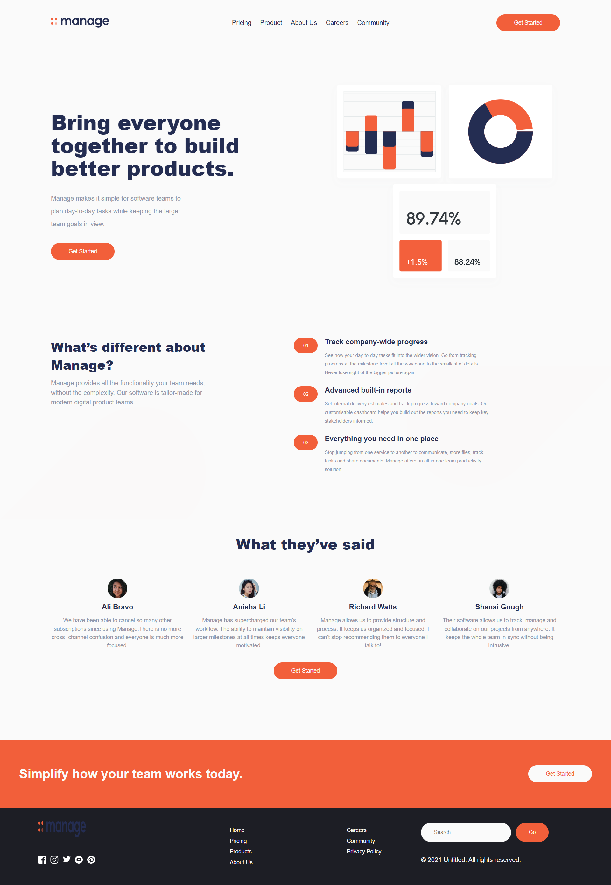

# Frontend Mentor - Manage landing page solution

This is a solution to the [Manage landing page challenge on Frontend Mentor](https://www.frontendmentor.io/challenges/manage-landing-page-SLXqC6P5). Frontend Mentor challenges help you improve your coding skills by building realistic projects. 

## Table of contents

- [Overview](#overview)
  - [The challenge](#the-challenge)
  - [Screenshot](#screenshot)
  - [Links](#links)
- [My process](#my-process)
  - [Built with](#built-with)
  - [What I learned](#what-i-learned)
  - [Continued development](#continued-development)
  - [Useful resources](#useful-resources)
- [Author](#author)
- [Acknowledgments](#acknowledgments)

## Overview

The "Manage Landing Page" is a user-friendly web application designed to streamline the process of creating and organizing landing pages for marketing campaigns. With its intuitive drag-and-drop editor and customizable templates, users can easily create visually appealing and effective landing pages. The application also offers content management capabilities, integration with marketing tools, and built-in analytics, empowering users to track performance metrics and optimize their marketing efforts. With its comprehensive features, the "Manage Landing Page" application is a valuable tool for businesses and marketers looking to create impactful landing pages and drive successful marketing campaigns.

### The challenge

Users should be able to:

- View the optimal layout for the site depending on their device's screen size
- See hover states for all interactive elements on the page
- See all testimonials in a horizontal slider
- Receive an error message when the newsletter sign up `form` is submitted if:
  - The `input` field is empty
  - The email address is not formatted correctly

### Screenshot

### Links

- Solution URL: [Add solution URL here](https://github.com/wolfgunblood/manage-landing-page)
- Live Site URL: [Add live site URL here](https://wolfgunblood.github.io/manage-landing-page/)

## My process

### Built with

- Semantic HTML5 markup
- CSS custom properties
- Flexbox
- CSS Grid
- Mobile-first workflow
- [React](https://reactjs.org/) - JS library

### What I learned

Through building the "Manage Landing Page" project, I have learned:

- How to create responsive and visually appealing web pages using HTML and CSS.
- The importance of user experience design in creating intuitive and user-friendly interfaces.
- Efficient content management techniques for organizing and displaying information effectively.
- Integration of third-party services, such as social media sharing and analytics tracking.
- The significance of performance optimization through analytics to enhance user engagement and conversion rates.
- Collaboration and teamwork skills by working on a project from conception to completion.
- Problem-solving and debugging skills to address issues encountered during development.
- Improved knowledge of version control and project management tools like Git and GitHub.
- Attention to detail and adherence to best practices for clean and maintainable code.
- Practical understanding of modern web development workflows and industry standards.

## Author

- Website - [Jalaj Doraiburu](https://wolfgunblood.github.io/portfolio/)
- Frontend Mentor - [@wolfgunblood](https://www.frontendmentor.io/profile/wolfgunblood)
- Twitter - [@jalaj_dorai](https://twitter.com/jalaj_dorai)

## Acknowledgments

I would like to express our gratitude to Frontend Mentor (https://www.frontendmentor.io) for providing the design and inspiration for this project. Frontend Mentor offers a vast collection of design challenges and projects that allow developers to enhance their skills by building real-world applications.
